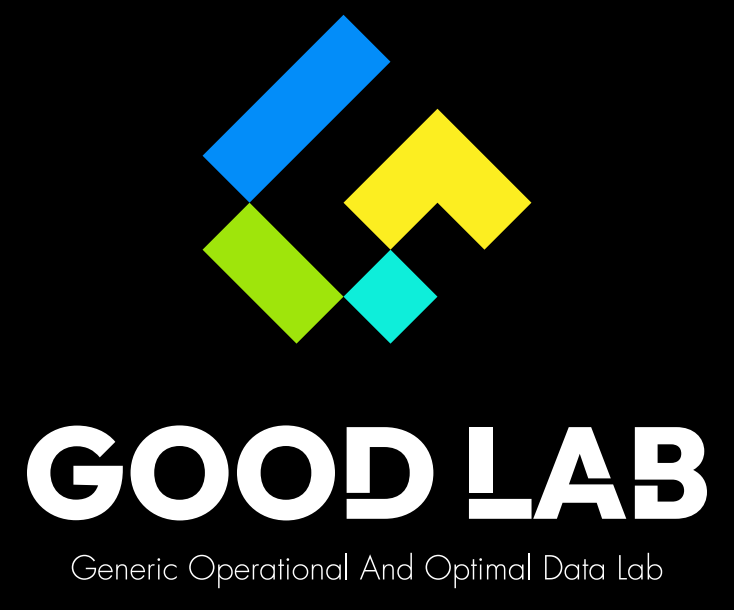

# 🧠 AI小鼠脑神经元钙信号分析平台

[](https://www.python.org/downloads/)
[](https://fastapi.tiangolo.com/)
[](https://vuejs.org/)
[](LICENSE)

> **GOODLAB小鼠脑神经分析小组出品** - 专业的小鼠脑神经元钙信号分析与可视化平台

## 📖 项目简介

本项目是一个专为小鼠脑神经科学研究设计的综合性钙信号分析平台，提供从数据预处理到高级分析的完整工作流。平台集成了先进的机器学习算法和交互式可视化技术，支持神经元活动的多维度分析。

### 🎯 核心功能

- **🔍 钙信号事件提取** - 智能检测和提取神经元钙离子瞬变事件
- **📊 聚类分析** - 基于K-means和DBSCAN的神经元活动模式聚类
- **🔥 热力图分析** - 多种热力图可视化，包括行为相关、时间序列和多天对比分析
- **🧮 主成分分析** - 神经元网络关键节点识别和效应量计算
- **🌐 Web界面** - 现代化的Vue.js前端界面，支持实时交互分析
- **🚀 高性能API** - FastAPI后端，支持批量处理和并发分析

## 🏗️ 项目架构

```
ai-mouse-analysis/
├── 📁 frontend/              # Vue.js前端应用
│   ├── src/
│   │   ├── views/            # 页面组件（首页、事件提取、聚类分析、热力图分析）
│   │   ├── api/              # API接口封装
│   │   └── router/           # 路由配置
│   └── package.json
├── 📁 backend/               # FastAPI后端服务
│   ├── main.py              # 主应用入口
│   ├── requirements.txt     # Python依赖
│   └── src/                 # 核心业务逻辑
│       ├── extraction_logic.py    # 事件提取逻辑
│       ├── clustering_logic.py    # 聚类分析逻辑
│       ├── heatmap_behavior.py    # 行为热力图
│       ├── heatmap_em_sort.py     # EM排序热力图
│       ├── heatmap_multi_day.py   # 多天对比热力图
│       └── overall_heatmap.py     # 整体热力图
├── 📁 algorithm/             # 核心算法模块
│   ├── extraction/          # 钙信号提取算法
│   ├── clustering/          # 聚类算法
│   ├── heatmap/            # 热力图生成算法
│   ├── principal_neuron/   # 主神经元分析（v2.0）
│   ├── effect_size/        # 效应量计算
│   └── trace/              # 轨迹分析
└── 📁 dataexample/          # 示例数据集
```

## 🛠️ 技术栈

### 后端技术
- **Python 3.8+** - 核心编程语言
- **FastAPI** - 现代化Web框架，支持自动API文档
- **Pandas & NumPy** - 数据处理和科学计算
- **Scikit-learn** - 机器学习算法
- **Matplotlib & Seaborn** - 数据可视化
- **SciPy** - 科学计算和信号处理

### 前端技术
- **Vue.js 3** - 渐进式JavaScript框架
- **Element Plus** - Vue 3 UI组件库
- **ECharts** - 交互式图表库
- **Axios** - HTTP客户端
- **Vite** - 现代化构建工具

## 🚀 快速开始

### 环境要求

- Python 3.8 或更高版本
- Node.js 16 或更高版本
- npm 或 yarn 包管理器

### 安装步骤

#### 1. 克隆项目
```bash
git clone https://github.com/your-repo/ai-mouse-analysis.git
cd ai-mouse-analysis
```

#### 2. 后端环境配置
```bash
cd backend

# 创建虚拟环境（推荐）
python -m venv venv
source venv/bin/activate  # Linux/Mac
# 或 venv\Scripts\activate  # Windows

# 安装依赖
pip install -r requirements.txt
```

#### 3. 前端环境配置
```bash
cd frontend

# 安装依赖
npm install
# 或 yarn install
```

### 启动服务

#### 启动后端服务
```bash
cd backend
python main.py
```
后端服务将在 `http://localhost:8000` 启动

#### 启动前端服务
```bash
cd frontend
npm run dev
```
前端应用将在 `http://localhost:5173` 启动

## 📚 功能模块详解

### 🔍 钙信号事件提取

**核心功能：**
- 自动检测神经元钙离子瞬变事件
- 支持多种预处理方法（移动平均、Butterworth滤波、归一化）
- 可调参数：信噪比阈值、持续时间、峰值距离等
- 批量处理多个神经元数据

**主要算法：**
- 基于峰值检测的钙瞬变识别
- 自适应阈值计算
- 形态学特征评分
- 指数衰减评分

### 📊 聚类分析

**支持算法：**
- **K-means聚类** - 经典的质心聚类算法
- **DBSCAN聚类** - 基于密度的聚类算法
- **自动K值优化** - 肘部法则和轮廓系数

**特征工程：**
- PCA降维
- 特征权重调整
- 多维特征可视化

### 🔥 热力图分析

#### 1. 行为序列热力图
- 分析特定行为前后的神经元活动模式
- 支持行为连续性检测
- 多种神经元排序方式

#### 2. EM排序热力图
- 基于峰值时间或钙波时间排序
- 支持自定义神经元顺序
- 时间区间筛选功能

#### 3. 多天对比热力图
- 跨天神经元活动对比分析
- 基于神经元对应表的数据对齐
- 生成组合和单独热力图

#### 4. 整体热力图
- 全时间段神经元活动概览
- 钙波检测和标记
- 多种排序和筛选选项

### 🧮 主神经元分析 (v2.0)

**新增功能：**
- 完整的效应量计算流程（Cohen's d）
- 从原始数据到效应量分析的端到端处理
- 关键神经元识别和可视化
- 神经元空间位置映射
- 自动阈值优化推荐

## 🔧 API文档

启动后端服务后，可访问以下地址查看完整API文档：

- **Swagger UI**: `http://localhost:8000/docs`
- **ReDoc**: `http://localhost:8000/redoc`

### 主要API端点

| 功能模块 | 端点 | 方法 | 描述 |
|---------|------|------|------|
| 事件提取 | `/api/extraction/preview` | POST | 预览提取结果 |
| 事件提取 | `/api/extraction/batch` | POST | 批量提取 |
| 聚类分析 | `/api/clustering/analyze` | POST | 执行聚类分析 |
| 聚类分析 | `/api/clustering/optimal_k` | POST | 寻找最优K值 |
| 热力图 | `/api/heatmap/analyze` | POST | 行为热力图分析 |
| 热力图 | `/api/heatmap/em-sort` | POST | EM排序热力图 |
| 热力图 | `/api/heatmap/multi-day` | POST | 多天对比热力图 |

## 📊 数据格式

### 输入数据格式

支持Excel (.xlsx) 和CSV (.csv) 格式，数据结构如下：

```
| timestamp | n1    | n2    | n3    | ... | behavior |
|-----------|-------|-------|-------|-----|----------|
| 0.0       | 1.23  | 2.45  | 1.67  | ... | rest     |
| 0.208     | 1.45  | 2.67  | 1.89  | ... | move     |
| ...       | ...   | ...   | ...   | ... | ...      |
```

- `timestamp`: 时间戳（秒）
- `n1, n2, n3, ...`: 神经元钙信号数据
- `behavior`: 行为标签（可选）

### 输出结果

- **事件提取**: Excel文件，包含检测到的钙瞬变事件详细信息
- **聚类分析**: JSON格式，包含聚类结果和可视化图表
- **热力图**: PNG图像文件和相关统计数据

## 🎨 使用示例

### 1. 通过Web界面使用

1. 启动前后端服务
2. 访问 `http://localhost:5173`
3. 选择相应功能模块
4. 上传数据文件
5. 配置分析参数
6. 查看和下载结果

### 2. 通过命令行使用

```bash
# 钙信号事件提取
cd algorithm/extraction
python element_extraction.py --data your_data.xlsx --output results/

# 主神经元分析
cd algorithm/principal_neuron
python src/main_emtrace01_analysis.py

# 热力图生成
cd algorithm/heatmap
python heatmap_behavior.py --input data.xlsx --start_behavior rest --end_behavior move
```

## 🤝 贡献指南

我们欢迎社区贡献！请遵循以下步骤：

1. Fork 本仓库
2. 创建特性分支 (`git checkout -b feature/AmazingFeature`)
3. 提交更改 (`git commit -m 'Add some AmazingFeature'`)
4. 推送到分支 (`git push origin feature/AmazingFeature`)
5. 开启 Pull Request

## 📄 许可证

本项目采用 MIT 许可证 - 查看 [LICENSE](LICENSE) 文件了解详情。

## 👥 开发团队

**GOODLAB小鼠脑神经分析小组**

- 专注于小鼠脑神经科学研究
- 致力于开发先进的数据分析工具
- 推动神经科学研究的数字化转型

## 📞 联系我们

如有问题或建议，请通过以下方式联系我们：

- 📧 Email: [your-email@example.com]
- 🐛 Issues: [GitHub Issues](https://github.com/your-repo/ai-mouse-analysis/issues)
- 📖 Wiki: [项目Wiki](https://github.com/your-repo/ai-mouse-analysis/wiki)

## 🔄 更新日志

### v2.0.0 (最新)
- ✅ 新增主神经元分析模块
- ✅ 完整效应量计算流程
- ✅ 多天对比热力图功能
- ✅ EM排序热力图优化
- ✅ Web界面全面升级

### v1.0.0
- ✅ 基础钙信号事件提取
- ✅ K-means和DBSCAN聚类
- ✅ 行为序列热力图
- ✅ FastAPI后端架构
- ✅ Vue.js前端界面

---

<div align="center">
  
  <br>
  <strong>GOODLAB小鼠脑神经分析小组出品</strong>
  <br>
  <em>让神经科学研究更智能、更高效</em>
</div>